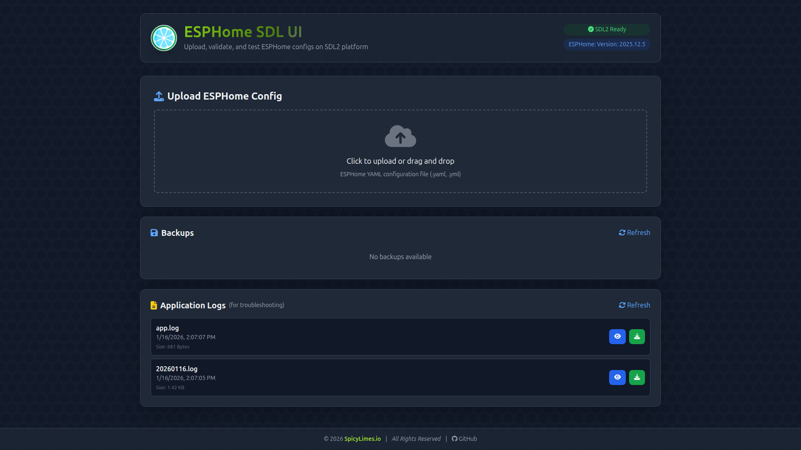

# ESPHome SDL UI



A web-based tool for testing ESPHome display configurations on the SDL2 platform. Upload, validate, auto-fix, and preview your ESPHome display configs on your Linux desktop without needing physical ESP32/ESP8266 hardware.

## Features

- **Upload & Validate** - Upload ESPHome YAML configs and validate them instantly with the ESPHome CLI
- **Auto-Fix** - Automatically convert ESP32/ESP8266 configs to SDL2-compatible format
- **SDL2 Preview** - Run your display configs on your Linux desktop using SDL2 with mouse emulation for touchscreens
- **Backup Management** - Automatic backups before modifications with restore and download capability
- **Compatibility Checker** - Identifies hardware-specific components that need removal or conversion
- **Application Logs** - Built-in log viewer for troubleshooting with level filtering

## Requirements

- **Linux** (Debian/Ubuntu-based distribution recommended)
- **Python 3.10+**
- **ESPHome** (can be pre-installed or installed during setup)
- **SDL2 libraries** (can be installed during setup)

## Installation

### Quick Start

```bash
# Clone the repository
git clone https://github.com/yourusername/ESPHome-SDL-UI.git
cd ESPHome-SDL-UI

# Make the launcher executable (if needed)
chmod +x esphome-sdl-ui

# Run the launcher (handles everything)
./esphome-sdl-ui
```

On first run, the launcher will:
1. Check system requirements (Python, permissions)
2. Detect existing ESPHome and SDL2 installations
3. Install any missing dependencies
4. Set up a Python virtual environment
5. Start the web application

### Manual Dependencies (if needed)

If you prefer to install dependencies manually:

```bash
# Install SDL2 libraries
sudo apt install libsdl2-2.0-0 libsdl2-dev

# Install ESPHome (if not already installed)
pip install esphome

# Install Python dependencies
pip install -r requirements.txt
```

## Usage

### Starting the Application

```bash
./esphome-sdl-ui
```

This opens an interactive menu:

```
╔═══════════════════════════════════════════════════════════════╗
║              ESPHome SDL UI - Control Panel                   ║
║                      Version 2.0.0                            ║
╚═══════════════════════════════════════════════════════════════╝

  Status: ● Running on http://localhost:6062

  Options:

    1) Start App
    2) Stop App
    3) App Status
    4) View Logs
    5) Update App
    6) Uninstall

    q) Quit
```

### Web Interface

Once started, open your browser to **http://localhost:6062**

1. **Upload** your ESPHome YAML configuration (drag & drop supported)
2. **Review** compatibility issues (if any are detected)
3. **Auto-Fix** to convert the config for SDL2
4. **Validate** with ESPHome CLI to check for errors
5. **Compile** the configuration
6. **Run** to see the display preview on your desktop

## How It Works

### Auto-Fix Process

When you click "Auto-Fix", the tool automatically:

1. **Creates a backup** of your original config
2. **Removes platform sections** for ESP32, ESP8266, ESP32-S2, ESP32-S3, ESP32-C3, RP2040
3. **Adds the `host:` component** required for SDL2
4. **Converts display platforms** (e.g., `ili9341`, `st7789v`, `ssd1306` → `sdl`)
5. **Converts touchscreens to SDL** (mouse emulation) - supports:
   - XPT2046, GT911, FT5x06, FT63x6, CST816, CST226, EKTF2232, TT21100, Lilygo T5 4.7
6. **Removes hardware-specific components**:
   - Communication buses: SPI, I2C, UART
   - Network: WiFi, MQTT, OTA, web_server
   - Hardware sensors: ADC, pulse counter
   - Hardware outputs: LEDC (LED PWM), light components, RTTTL buzzers
7. **Preserves Home Assistant integrations** (keeps `api:` when HA sensors are present)
8. **Cleans up orphaned action references** (e.g., `rtttl.play` when RTTTL is removed)

### What's Preserved

- All display lambdas and rendering code
- Fonts (including Google Fonts and custom fonts)
- Colors and global variables
- Home Assistant sensor integrations (`homeassistant` platform sensors)
- Text sensors and binary sensors (non-hardware)
- Display pages and UI elements
- Touchscreen button configurations

## API Reference

The application exposes a REST API for all operations:

### Configuration Management
| Endpoint | Method | Description |
|----------|--------|-------------|
| `/api/upload` | POST | Upload a YAML configuration file |
| `/api/configs` | GET | List all uploaded configurations |
| `/api/auto-fix/{filename}` | POST | Auto-convert config for SDL2 |
| `/api/validate/{filename}` | POST | Validate config with ESPHome |
| `/api/compile/{filename}` | POST | Compile the configuration |
| `/api/run/{filename}` | POST | Run SDL2 display preview |
| `/api/stop` | POST | Stop running SDL2 preview |
| `/api/status` | GET | Check if SDL2 preview is running |
| `/api/version` | GET | Get ESPHome version |

### Backup Management
| Endpoint | Method | Description |
|----------|--------|-------------|
| `/api/backups` | GET | List all backups |
| `/api/restore/{backup}/{target}` | POST | Restore a backup |
| `/api/backups/{name}` | DELETE | Delete a backup |
| `/api/backups/{name}/download` | GET | Download a backup file |

### Log Management
| Endpoint | Method | Description |
|----------|--------|-------------|
| `/api/logs` | GET | List all log files |
| `/api/logs/{filename}` | GET | Get log content (params: `lines`, `level`) |
| `/api/logs/{filename}/download` | GET | Download a log file |
| `/api/logs/cleanup` | DELETE | Delete old logs (param: `days`) |

## File Structure

```
ESPHome-SDL-UI/
├── esphome-sdl-ui          # Main launcher script (bash)
├── README.md               # This file
├── LICENSE                 # MIT License
├── requirements.txt        # Python dependencies
├── .gitignore
│
├── app/                    # Application source code
│   ├── main.py             # FastAPI application & API endpoints
│   ├── backend/            # Backend modules
│   │   ├── config.py       # Configuration settings
│   │   ├── logger.py       # Logging with rotation
│   │   ├── yaml_parser.py  # YAML parsing with !secret support
│   │   ├── sdl2_compatibility.py  # Compatibility checker & auto-fixer
│   │   ├── backup_manager.py      # Backup/restore functionality
│   │   └── esphome_cli.py  # ESPHome CLI wrapper
│   └── templates/
│       └── index.html      # Web UI (Alpine.js + Tailwind CSS)
│
├── configs/                # Uploaded configurations (user data)
├── backups/                # Automatic backups (user data)
├── logs/                   # Application logs
│
└── .esphome-sdl-ui/        # Internal files (auto-created at runtime)
    ├── venv/               # Python virtual environment
    ├── config              # Saved configuration (ESPHome path, etc.)
    └── pid                 # Running process ID
```

## Configuration

### Environment Variables

| Variable | Default | Description |
|----------|---------|-------------|
| `APP_PORT` | `6062` | Port for the web server |
| `ESPHOME_PATH` | `esphome` | Path to ESPHome binary |

### Changing the Port

```bash
APP_PORT=8080 ./esphome-sdl-ui
```

## Updating

From the menu, select option `5) Update App` or manually:

```bash
cd ESPHome-SDL-UI
git pull
./esphome-sdl-ui
```

The launcher will detect and install any new dependencies automatically.

## Uninstalling

From the menu, select option `6) Uninstall` or manually:

```bash
# Remove the virtual environment and runtime config
rm -rf .esphome-sdl-ui

# Optionally remove user data
rm -rf configs/* backups/* logs/*

# Remove the entire directory
cd .. && rm -rf ESPHome-SDL-UI
```

## Troubleshooting

### Viewing Application Logs

The web UI includes a **Logs** section at the bottom where you can:
- View log files directly in the browser
- Filter by log level (DEBUG, INFO, WARNING, ERROR)
- Copy log content to clipboard
- Download log files for sharing

Logs are automatically rotated (5MB max, 5 backup files kept).

### ESPHome not found

If the launcher can't find ESPHome:
1. Enter the path to your ESPHome installation when prompted
2. Or let the installer set up ESPHome in the virtual environment automatically

### Port already in use

If port 6062 is in use:
1. Stop any existing instance: Select `2) Stop App` from the menu
2. Or check what's using the port: `ss -tuln | grep 6062`
3. Or use a different port: `APP_PORT=8080 ./esphome-sdl-ui`

### SDL2 preview not working

Ensure SDL2 libraries are installed:
```bash
sudo apt install libsdl2-2.0-0 libsdl2-dev
```

If you're using a headless server, SDL2 requires a display. You may need to set up X11 forwarding or use a virtual framebuffer.

### Permission denied

Make sure the launcher is executable:
```bash
chmod +x esphome-sdl-ui
```

### Compilation times out

The default compilation timeout is 10 minutes (600 seconds). For complex configurations on slower hardware, this may not be enough. Check the logs for timeout errors.

### Getting Help

If you encounter issues:
1. Check the **Logs** section in the web UI
2. Filter by **ERROR** level to find problems quickly
3. Download the latest log file
4. Open an issue on GitHub with:
   - The log content
   - Your ESPHome version (`esphome version`)
   - Your Python version (`python3 --version`)
   - Steps to reproduce the issue

## License

MIT License - See [LICENSE](LICENSE) for details.

## Contributing

Contributions are welcome! Please feel free to submit issues and pull requests.

When contributing:
1. Fork the repository
2. Create a feature branch
3. Make your changes
4. Run the application to test
5. Submit a pull request

## Acknowledgments

- [ESPHome](https://esphome.io/) - The amazing home automation firmware
- [SDL2](https://www.libsdl.org/) - Simple DirectMedia Layer for display emulation
- [FastAPI](https://fastapi.tiangolo.com/) - Modern Python web framework
- [Alpine.js](https://alpinejs.dev/) - Lightweight JavaScript framework
- [Tailwind CSS](https://tailwindcss.com/) - Utility-first CSS framework
